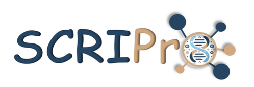
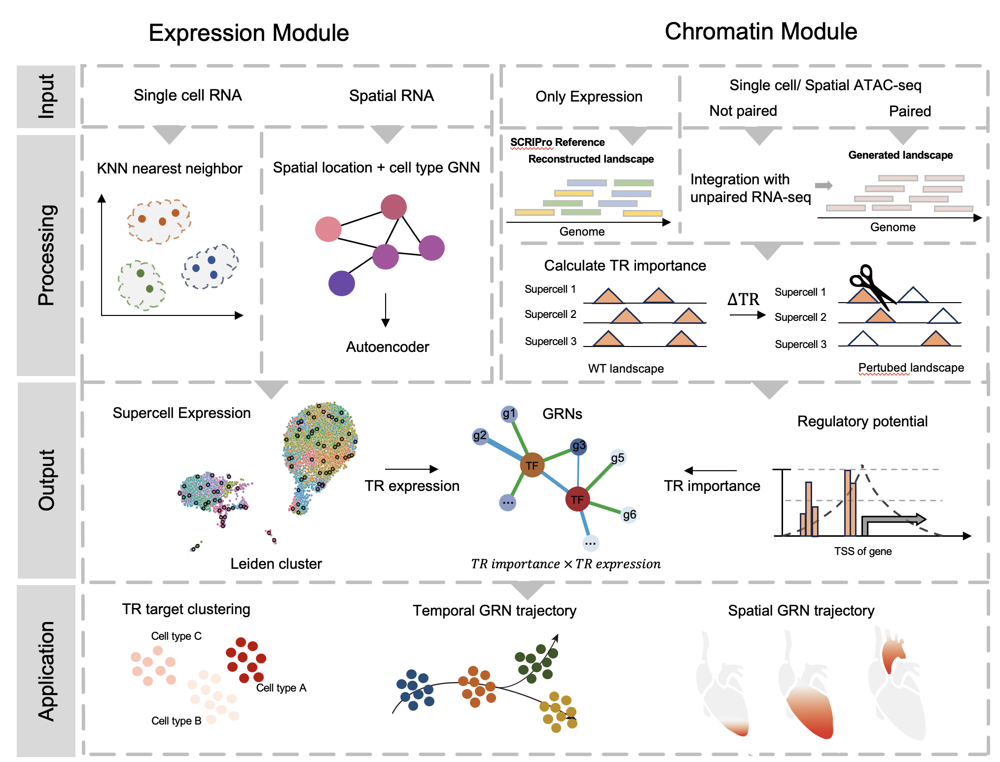

# SCRIPro

[](https://scripro.readthedocs.io/en/latest/?badge=latest)
[](https://badge.fury.io/py/scripro)

[](https://github.com/wanglabtongji/SCRIPro)

The increasing availability of single-cell genomics data allows characterizing gene regulation networks (GRNs) at an unprecedented resolution. Previously we developed SCRIP, a computational method that integrates single-cell ATAC-seq data with a large-scale transcription regulator (TR) ChIP-seq data and motif reference for reconstructing single-cell TR activities and GRNs.  
Here, we present SCRIPro, an extended framework of SCRIP that suits both single-cell and spatial multi-ome data. SCRIPro first performed a density clustering based on expression and spatial similarity of the data to generate high coverage SuperCells. Next, SCRIPro performed in silico deletion analyses based on matched scATAC-seq or reconstructed chromatin landscapes from Cistrome accessibility data to evaluate the importance of TRs in regulating each SuperCell. Finally, SCRIPro combines the importance score of each TR with its gene expression, which generates the TR-centered GRNs at Supercell resolution. We applied SCRIPro on human PBMC and human B-cell lymphoma scMulti-ome data, as well as mouse developing embryo spatial transcriptomic data, and demonstrated that SCRIPro is able to identify cell-type-specific TR regulations and show superior performance compared to conventional motif-based methods such as SCENIC+. Taken together, SCRIPro is a convenient and fast method that could reconstruct TR activities and GRNs for both single-cell and spatial multi-omic data.



## Documentation

For the detailed usage and examples of SCRIPro, please refer to the [documentation](https://scripro.readthedocs.io/en/latest).  
For any problems encountered in using, feel free to open an [issue](https://github.com/xuyunfan9991/SCRIPro/issues).  

## Installation

### Use the following commands to install Minicoda3:

``` bash
wget https://repo.continuum.io/miniconda/Miniconda3-latest-Linux-x86_64.sh
bash Miniconda3-latest-Linux-x86_64.sh
```

It is recommended to install scripro to a conda virtual environment.:

``` bash
conda create -n scripro python=3.8
conda install -c liulab-dfci lisa2
lisa install hg38 oneshot ./hg38_scripro.h5 --force
lisa install mm10 oneshot ./mm10_scripro.h5 --force
scripro install_reference -i TF_target_RP.h5
```

`hg38_scripro.h5`, `mm10_scripro.h5` and `TF_target_RP.h5` can be downloaded from [Zenodo](https://zenodo.org/doi/10.5281/zenodo.10554172).

### Install SCRIPro from Github (developing version)

```bash
git clone git@github.com:wanglabtongji/SCRIPro.git
cd SCRIPro
python setup.py install
```

### Install SCRIPro from Pypi

```bash
pip install scripro
```

## Usage

### Main command

```
usage: scripro [-h] [--version] {enrich_rna,enrich_multiome,get_tf_target,enrich_atac,install_reference} ...

scripro

positional arguments:
{enrich_rna,enrich_multiome,get_tf_target,enrich_atac,install_reference}
    enrich_rna          Calculate TF activation use scRNA-seq data
    enrich_multiome     Calculate TF activation use scRNA-seq data and scATAC-seq data
    get_tf_target       Calculate TF and target gene score for scRNA-seq data and sc multiome data
    enrich_atac         Invoke SCRIP
    install_reference   Install RP reference


optional arguments:
-h, --help            show this help message and exit
--version             show program's version number and exit

For command line options of each command, type: scripro COMMAND -h
```

### Subcommand

```
scripro enrich_rna [-h] -i FEATURE_MATRIX -n CELL_NUM -s {hg38,mm10} -p PROJECT [-t N_CORES]

optional arguments:
  -h, --help            show this help message and exit

Input files arguments:
  -i FEATURE_MATRIX, --input_feature_matrix FEATURE_MATRIX
                        scRNA-seq data matrix . REQUIRED.
  -n CELL_NUM, --cell_number CELL_NUM
                        Supercell Cell Number . REQUIRED.
  -s {hg38,mm10}, --species {hg38,mm10}
                        Species. "hg38"(human) or "mm10"(mouse). REQUIRED.

Output arguments:
  -p PROJECT, --project PROJECT
                        Project name, which will be used to generate output files.

Other options:
  -t N_CORES, --thread N_CORES
                        Number of cores use to run SCRIPro. DEFAULT: 8.

```

```
scripro enrich_multiome [-h] -i FEATURE_MATRIX -n CELL_NUM -s {hg38,mm10} -a {fragment,matrix} -b {0,1} -f ATAC_PATH [-g GLUE_ANNOTATION] -p
                               PROJECT [-t N_CORES]

optional arguments:
  -h, --help            show this help message and exit

Input files arguments:
  -i FEATURE_MATRIX, --input_feature_matrix FEATURE_MATRIX
                        A cell by peak matrix . REQUIRED.
  -n CELL_NUM, --cell_number CELL_NUM
                        Supercell Cell Number . REQUIRED.
  -s {hg38,mm10}, --species {hg38,mm10}
                        Species. "hg38"(human) or "mm10"(mouse). REQUIRED.
  -a {fragment,matrix}, --atac_file_type {fragment,matrix}
                        atac_file_type,"fragment" or "matrix(h5,h5ad,mtx)"
  -b {0,1}, --barcode_corresponds {0,1}
                        Whether the scRNA-seq barcode matches the scATAC-seq barcode. "0"(Match) or "1"(Not match). REQUIRED.
  -f ATAC_PATH, --atac_file ATAC_PATH
                        ATAC file path.REQUIRED.
  -g GLUE_ANNOTATION, --glue_annotation GLUE_ANNOTATION
                        If the scRNA-seq barcodes \do not match the scATAC-seq barcodes, the glue_annotation file that will be used.,like
                        'gencode.v43.chr_patch_hapl_scaff.annotation.gtf.gz'

Output arguments:
  -p PROJECT, --project PROJECT
                        Project name, which will be used to generate output files.

Other options:
  -t N_CORES, --thread N_CORES
                        Number of cores use to run SCRIPros. DEFAULT: 8.

```

```
scripro get_tf_target [-h] -i SCRIPRO_RESULT -t TF_NAME -p PROJECT

optional arguments:
  -h, --help            show this help message and exit

Input files arguments:
  -i SCRIPRO_RESULT, --input_scripro_result SCRIPRO_RESULT
                        scripro result pickle file. REQUIRED.
  -t TF_NAME, --tf_name TF_NAME
                        Tf name to calculate the target . REQUIRED.

Output arguments:
  -p PROJECT, --project PROJECT
                        Project name, which will be used to generate output file.
```

```
  scripro enrich_atac enrich [-h] -i FEATURE_MATRIX -s {hs,mm} [-p PROJECT] [--min_cells MIN_CELLS] [--min_peaks MIN_PEAKS] [--max_peaks MAX_PEAKS] [-t N_CORES] [-m {max,mean}] [-y] [--clean]

  optional arguments:
  -h, --help            show this help message and exit

  Input files arguments:
  -i FEATURE_MATRIX, --input_feature_matrix FEATURE_MATRIX
                          A cell by peak matrix . REQUIRED.
  -s {hs,mm}, --species {hs,mm}
                          Species. "hs"(human) or "mm"(mouse). REQUIRED.

  Output arguments:
  -p PROJECT, --project PROJECT
                          Project name, which will be used to generate output files folder. DEFAULT: Random generate.

  Preprocessing paramater arguments:
  --min_cells MIN_CELLS
                          Minimal cell cutoff for features. Auto will take 0.05% of total cell number.DEFAULT: "auto".
  --min_peaks MIN_PEAKS
                          Minimal peak cutoff for cells. Auto will take the mean-3*std of all feature number (if less than 500 is 500). DEFAULT: "auto".
  --max_peaks MAX_PEAKS
                          Max peak cutoff for cells. This will help you to remove the doublet cells. Auto will take the mean+5*std of all feature
                          number. DEFAULT: "auto".

  Other options:
  -t N_CORES, --thread N_CORES
                          Number of cores use to run SCRIP. DEFAULT: 16.
  -m {max,mean}, --mode {max,mean}
                          Deduplicate strategy. DEFAULT: max.

```